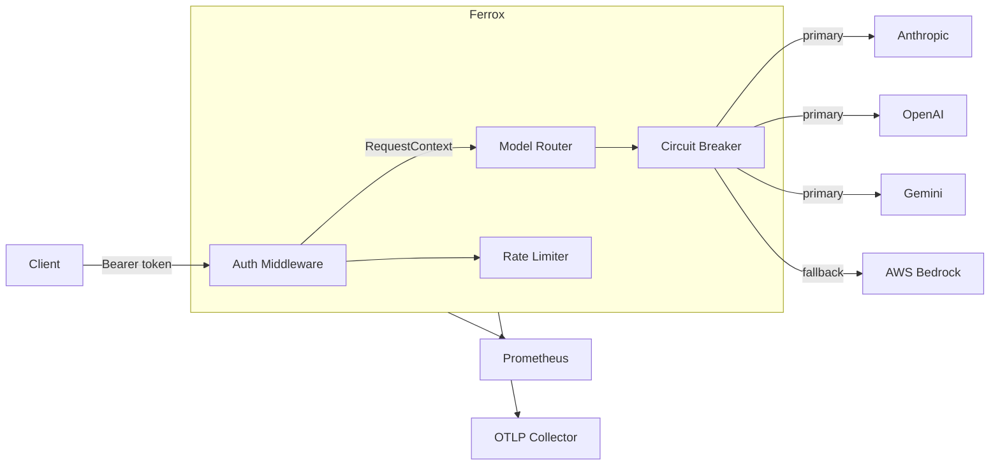

# Ferrox

[](LICENSE)
[](https://github.com/shaharia-lab/ferrox/actions)

Ferrox is a stateless, horizontally-scalable LLM API gateway written in Rust. It exposes an OpenAI-compatible API and routes requests to Anthropic, OpenAI, Gemini, and AWS Bedrock.

## Features

- **OpenAI-compatible API** - drop-in replacement; no client-side changes needed
- **Multi-provider routing** - round-robin, weighted, failover, and random strategies
- **Fallback chains** - automatic failover to backup providers on failure
- **Circuit breakers** - lock-free, per-provider; prevents cascading failures
- **Rate limiting** - per-key token bucket; burst-aware
- **Virtual keys** - issue scoped API keys with per-model access control
- **Streaming** - full SSE pass-through for all providers
- **Observability** - Prometheus metrics, structured JSON logs, OpenTelemetry tracing

## Architecture



## Installation

### Pre-built binary

Download the latest release for your platform from [GitHub Releases](https://github.com/shaharia-lab/ferrox/releases/latest):

```bash
# macOS (Apple Silicon)
curl -L https://github.com/shaharia-lab/ferrox/releases/latest/download/ferrox-aarch64-apple-darwin.tar.gz | tar xz
sudo mv ferrox /usr/local/bin/

# macOS (Intel)
curl -L https://github.com/shaharia-lab/ferrox/releases/latest/download/ferrox-x86_64-apple-darwin.tar.gz | tar xz
sudo mv ferrox /usr/local/bin/

# Linux (x86_64)
curl -L https://github.com/shaharia-lab/ferrox/releases/latest/download/ferrox-x86_64-unknown-linux-gnu.tar.gz | tar xz
sudo mv ferrox /usr/local/bin/

# Linux (ARM64)
curl -L https://github.com/shaharia-lab/ferrox/releases/latest/download/ferrox-aarch64-unknown-linux-gnu.tar.gz | tar xz
sudo mv ferrox /usr/local/bin/
```

### Homebrew (macOS and Linux)

```bash
brew install shaharia-lab/tap/ferrox
```

To install a specific version:

```bash
brew install shaharia-lab/tap/ferrox@1.0.0
```

### Docker

```bash
docker pull ghcr.io/shaharia-lab/ferrox:latest
```

Or with Docker Compose (includes full LGTM observability stack):

```bash
docker compose up
```

Starts Ferrox + Grafana (`:3000`), OTLP (`:4317`), and the full logging/tracing/metrics stack.

### Build from source

```bash
# Prerequisites: Rust 1.74+, protobuf-compiler
# Ubuntu/Debian: sudo apt install protobuf-compiler
# macOS: brew install protobuf

git clone https://github.com/shaharia-lab/ferrox
cd ferrox
cargo build --release
# Binary at: ./target/release/ferrox
```

## Quick Start

### Binary or Homebrew

```bash
# 1. Copy the minimal config (pre-configured with sensible defaults)
cp config/config_minimal.yaml config/local.yaml

# 2. Set your API keys
export ANTHROPIC_API_KEY=sk-ant-...
export OPENAI_API_KEY=sk-...

# 3. Run
LLM_PROXY_CONFIG=config/local.yaml ferrox
```

### Docker

```bash
# 1. Download the minimal config
curl -Lo local.yaml https://raw.githubusercontent.com/shaharia-lab/ferrox/main/config/config_minimal.yaml

# 2. Run (API keys passed as env vars)
docker run -p 8080:8080 \
  -e ANTHROPIC_API_KEY=sk-ant-... \
  -v $(pwd)/local.yaml:/etc/ferrox/config.yaml \
  ghcr.io/shaharia-lab/ferrox:latest \
  ferrox --config /etc/ferrox/config.yaml
```

Send a request:

```bash
curl http://localhost:8080/v1/chat/completions \
  -H "Authorization: Bearer sk-local-dev" \
  -H "Content-Type: application/json" \
  -d '{
    "model": "claude-sonnet",
    "messages": [{"role": "user", "content": "Hello"}]
  }'
```

## Documentation

### User guides

| Guide | Description |
|---|---|
| [Quick Start](docs/user/quickstart.md) | Get running in 5 minutes |
| [Configuration](docs/user/configuration.md) | Full config reference |
| [Providers](docs/user/providers.md) | Anthropic, OpenAI, Gemini, Bedrock setup |
| [Routing](docs/user/routing.md) | Strategies, failover, circuit breakers |
| [Virtual Keys](docs/user/virtual-keys.md) | Auth, rate limits, model access |
| [API Reference](docs/user/api-reference.md) | Endpoints and request/response formats |
| [Observability](docs/user/observability.md) | Metrics, tracing, logging |

### Developer guides

| Guide | Description |
|---|---|
| [Architecture](docs/developer/architecture.md) | System design and request flow |
| [Development](docs/developer/development.md) | Build, test, contribute |
| [Deployment](docs/developer/deployment.md) | Docker |

## License

MIT. See [LICENSE](LICENSE).
