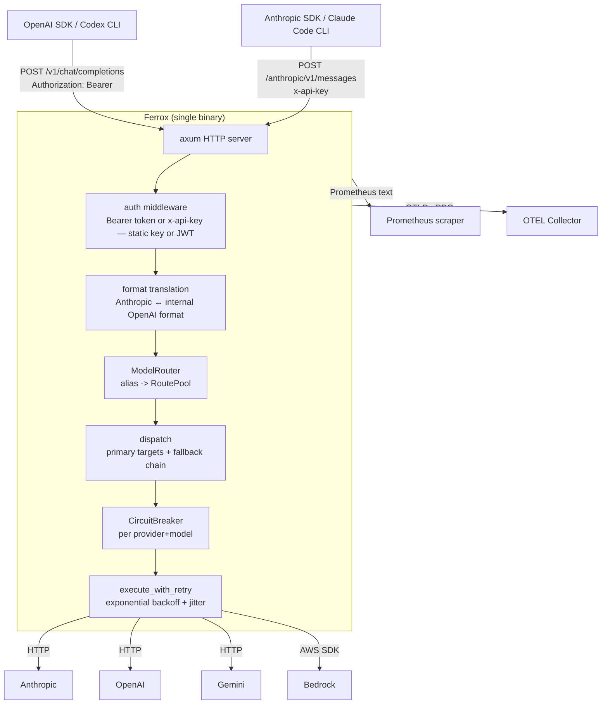
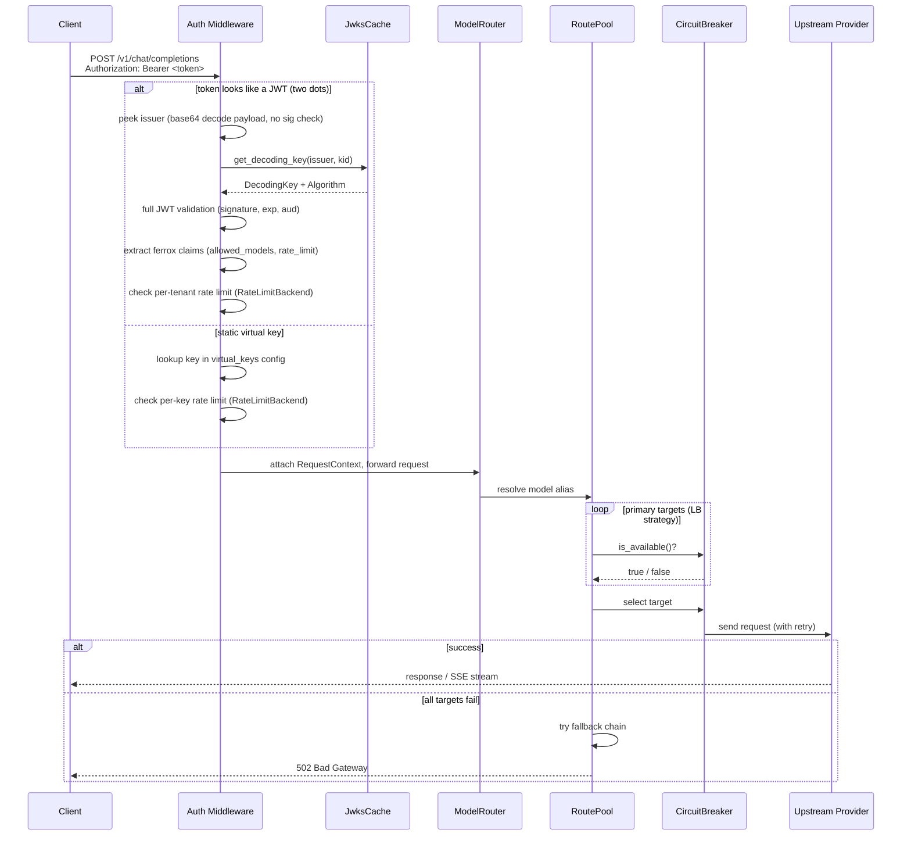
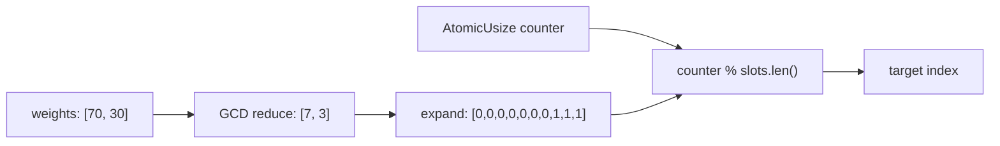
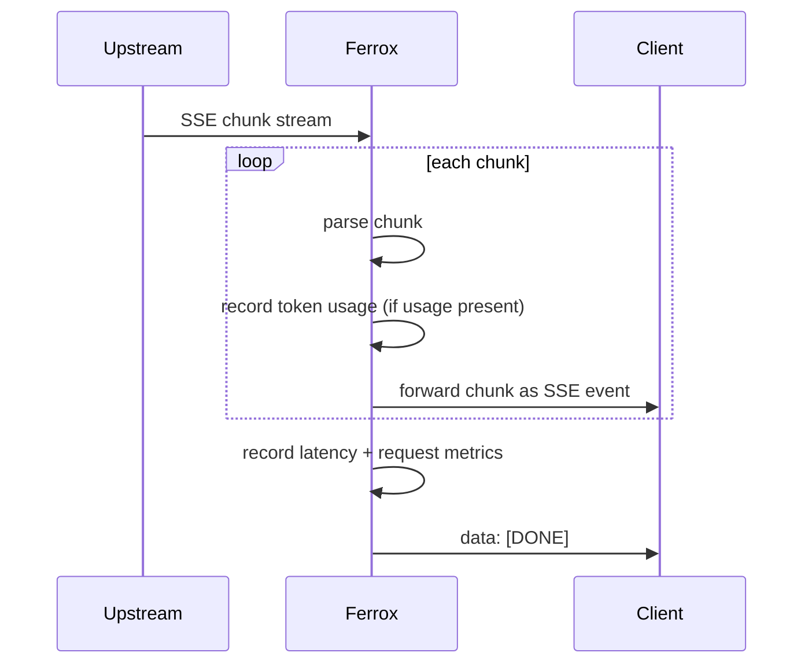
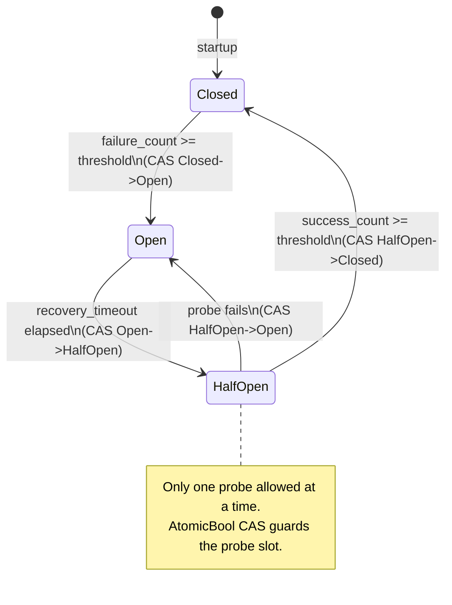

# Architecture

## Overview

Ferrox is a stateless HTTP proxy. Every request is self-contained; no session state is shared between instances. This makes it trivially horizontally scalable.



## Repository layout

This is a Cargo workspace with two crates:

- **`ferrox/`** — the gateway binary (this document describes its internals)
- **`ferrox-cp/`** — the control plane binary (Phase 3, in progress)

## Control plane (`ferrox-cp`)

The control plane manages JWT signing keys, API clients, and token issuance. It is a separate binary in the workspace (`ferrox-cp/`) that connects to a PostgreSQL database.

The single binary exposes four concerns on the same port (`CP_PORT`, default `9090`):

| Path prefix | Auth | Description |
|---|---|---|
| `/.well-known/`, `/token`, `/healthz` | none / client key | Public API |
| `/api/*` | `CP_ADMIN_KEY` Bearer | Admin REST API |
| `/` (everything else) | — | Embedded React SPA |

### Admin UI

A React + TypeScript SPA is embedded in the binary at compile time via `include_dir!`.
Axum serves it through a `.fallback(serve_spa)` handler — API routes always take
priority.  The SPA communicates exclusively with the admin REST API using the
`CP_ADMIN_KEY` stored in `localStorage` after the login screen validates it.

```
GET /  →  serve_spa  →  index.html  →  React Router handles client-side navigation
GET /assets/*.js  →  serve_spa  →  embedded JS bundle (MIME: application/javascript)
```

The UI is built with `npm run build` in `ferrox-cp/ui/` and outputs to `ferrox-cp/ui/dist/`.
Docker builds this in a dedicated `node:22-slim` stage before the Rust builder.  A
committed placeholder `dist/index.html` keeps `cargo build` working without a prior
npm build.

### Public API

Three HTTP endpoints served by an axum router on `CP_PORT` (default `9090`):

| Endpoint | Auth | Description |
|---|---|---|
| `GET /.well-known/jwks.json` | None | Active public keys in JWKS format; `Cache-Control: max-age=300` |
| `POST /token` | Bearer `sk-cp-<key>` | Exchange API key for a signed JWT |
| `GET /healthz` | None | DB connectivity probe; `503` if unreachable |

**Token issuance flow (`POST /token`):**

1. Extract `sk-cp-<key>` from `Authorization: Bearer`
2. Look up client by 8-char key prefix (fast indexed lookup)
3. `bcrypt::verify` the full key against stored hash (run on blocking thread)
4. Check `client.active = true`
5. Decrypt active signing key (AES-256-GCM), build `JwtSigner`, sign JWT
6. Write `token_issued` audit log entry (non-fatal if this fails)
7. Return `{access_token, token_type, expires_in}`

### Crypto core

The crypto layer (`ferrox-cp/src/crypto/`) provides three capabilities:

| Module | Responsibility |
|---|---|
| `keys` | Generate RSA-2048 keypairs; exports private key as PKCS#1 DER, public key as SubjectPublicKeyInfo DER |
| `encrypt` | AES-256-GCM encrypt/decrypt; stored blob format is `[12-byte nonce][ciphertext+tag]` |
| `jwks` | Convert a DER public key to a JWK object (RFC 7517) for the JWKS endpoint |
| `jwt` | `JwtSigner` — signs JWTs for clients; claims include `ferrox.allowed_models`, `ferrox.rate_limit`, `ferrox.client_id`, `ferrox.token_budget`, `ferrox.budget_period` |

**Private key storage pipeline:**

```
generate_keypair()          → PKCS#1 DER (plaintext)
  ↓ encrypt_private_key()   → [nonce][ciphertext]  stored in signing_keys.private_key (BYTEA)
  ↓ decrypt_private_key()   → PKCS#1 DER (plaintext)
  ↓ EncodingKey::from_rsa_der  → signs JWT
```

**Startup key seeding:** if `signing_keys` is empty at startup, one RSA-2048 keypair is generated and persisted automatically. Subsequent restarts detect the existing key and skip generation (idempotent).

### Data layer

Four tables form the persistence model:

| Table | Purpose |
|---|---|
| `clients` | API client registrations — name, bcrypt-hashed key, allowed models, rate-limit settings, token budget |
| `signing_keys` | RS256 keypairs — private key is AES-256-GCM encrypted at rest; public key is DER-encoded SubjectPublicKeyInfo |
| `audit_log` | Append-only event log — `client_created`, `token_issued`, `key_rotated`, `client_revoked`, `budget_exceeded` |
| `usage_log` | Per-request token usage records written by the gateway — client, model, provider, prompt/completion tokens, latency |

Migrations are embedded in the binary at compile time via `sqlx::migrate!("./migrations")` and applied at startup. The `MIGRATOR` static is `pub` so integration tests can reference it with `#[sqlx::test(migrator = "crate::MIGRATOR")]`.

### Repository pattern

Each table has a typed repository struct (`ClientRepository`, `SigningKeyRepository`, `AuditRepository`). All SQL is written with runtime queries (`sqlx::query_as::<_, T>(sql).bind(...)`) rather than compile-time macros so the binary compiles without a live database. Repositories borrow a `&PgPool` and are cheap to construct per request.

```
ferrox-cp/src/
  main.rs             startup, MIGRATOR static, axum router wiring, background tasks
  budget.rs           periodic budget checker (revokes over-budget clients every 60s)
  config.rs           CpConfig loaded from env vars
  state.rs            CpState (db pool + config, Arc-wrapped)
  ui.rs               SPA handler: include_dir! embedding + MIME-typed serving

  handlers/
    health.rs         GET /healthz
    jwks.rs           GET /.well-known/jwks.json
    token.rs          POST /token
    admin/
      clients.rs      CRUD + revoke + usage + budget + reactivate
      signing_keys.rs list + rotate
      audit.rs        filterable list

  middleware/
    admin_auth.rs     Bearer token check (subtle::ConstantTimeEq)

  db/
    mod.rs            re-exports all repo types
    models.rs         Client, SigningKey, AuditEntry, AuditEvent, UsageRecord, UsageSummary
    error.rs          RepoError (Conflict / NotFound / Database)
    client_repo.rs    CRUD + revoke + paginate + budget + reactivate + find_over_budget
    signing_key_repo.rs  create / get_active / retire for signing keys
    audit_repo.rs     record / list / count_tokens_issued
    usage_repo.rs     batch insert + summarize + paginated list for usage records

ferrox-cp/migrations/
  20240001000000_initial_schema.sql
  20240002000000_usage_log.sql
  20240003000000_client_budgets.sql

ferrox-cp/ui/       React SPA (Vite + TypeScript + Tailwind)
  src/
    pages/          Dashboard, Clients, ClientDetail, SigningKeys, AuditLog, Login
    components/     Layout sidebar, minimal Tailwind UI kit
    api.ts          typed fetch wrapper, localStorage key storage
  dist/
    index.html      placeholder (real build output is git-ignored)
```

### Environment variables

| Variable | Required | Default | Description |
|---|---|---|---|
| `DATABASE_URL` | yes | — | PostgreSQL connection string |
| `CP_ENCRYPTION_KEY` | yes | — | 64 hex chars (32 bytes) — AES-256-GCM key for private keys at rest |
| `CP_ADMIN_KEY` | yes | — | Static bearer token protecting all admin endpoints |
| `CP_ISSUER` | no | `https://ferrox-cp` | `iss` claim in signed JWTs |
| `CP_PORT` | no | `9090` | TCP port for the control-plane HTTP server |

---

## Gateway module map

```
ferrox/src/
  main.rs             startup, graceful shutdown
  server.rs           axum router, middleware stack
  config.rs           YAML loading, env var interpolation, validation
  state.rs            AppState (shared, Arc-wrapped)
  auth.rs             Bearer token auth: static virtual key or JWKS-validated JWT + budget reservation
  budget_enforcer.rs  BudgetEnforcer trait, RedisBudgetEnforcer (Lua scripts), NoopBudgetEnforcer
  usage_writer.rs     async batched writer: mpsc channel → background flush to usage_log table
  jwks.rs             JWKS cache: fetch, TTL refresh, stale fallback, background task
  router.rs           ModelRouter: alias -> Arc<RoutePool>
  error.rs            ProxyError enum, OpenAI-format HTTP responses
  types.rs            OpenAI wire types (request, response, chunk)
  retry.rs            execute_with_retry, is_retryable, backoff_duration
  metrics.rs          thin shim: initialises telemetry::metrics at startup

  providers/
    mod.rs            ProviderAdapter trait, ProviderRegistry, parse_sse_stream
    anthropic.rs      Anthropic Messages API adapter
    openai.rs         OpenAI Chat Completions adapter
    gemini.rs         Gemini generateContent adapter
    bedrock.rs        AWS Bedrock invoke_model adapter

  lb/
    mod.rs            RoutePool, RouteTarget, select_target
    strategy.rs       LbStrategy: RoundRobin, Weighted, Failover, Random
    circuit_breaker.rs  lock-free CircuitBreaker (AtomicU8 state, AtomicU32 counters)

  ratelimit/
    mod.rs            re-exports: RateLimitBackend trait, MemoryBackend, RedisBackend
    backend.rs        RateLimitBackend async trait
    memory.rs         MemoryBackend: lock-free per-instance token buckets (default)
    redis_backend.rs  RedisBackend: sliding-window Lua script via deadpool-redis
    token_bucket.rs   lock-free TokenBucket (AtomicU64 milli-tokens, CAS loop)

  telemetry/
    mod.rs            init_logging (tracing-subscriber stack)
    metrics.rs        Prometheus Lazy<CounterVec/HistogramVec/GaugeVec> statics
    otel.rs           OTLP tracer initialisation and shutdown

  handlers/
    mod.rs
    chat.rs           chat_completions handler, dispatch_non_stream, dispatch_stream
    health.rs         /healthz, /readyz
    models.rs         /v1/models
```

---

## Request lifecycle



---

## Concurrency model

The hot path (routing, circuit breaking, memory rate limiting) is entirely lock-free. The `RwLock` for the JWKS cache is taken only on TTL refresh — rare after warmup.

| Component | Primitive | Notes |
|---|---|---|
| Circuit breaker state | `AtomicU8` | CAS transitions between Closed/Open/HalfOpen |
| Circuit breaker probe guard | `AtomicBool` | CAS allows exactly one probe at a time |
| Failure/success counters | `AtomicU32` | Incremented with `fetch_add` |
| Token bucket (memory backend) | `AtomicU64` | CAS loop subtracts tokens |
| Round-robin counter | `AtomicUsize` | Monotonically incrementing, modulo target count |
| Weighted slot counter | `AtomicUsize` | Monotonically incrementing, modulo slot array length |
| JWKS key cache | `tokio::sync::RwLock` | Write held briefly on TTL refresh (background task) |
| MemoryBackend bucket map | `std::sync::RwLock` | Write held only when a new key is first seen |
| Redis backend | `deadpool-redis` async pool | One Lua round-trip per rated request |

The `AppState` struct is wrapped in `Arc` and cloned into each request handler. The rate limit backend (`Arc<dyn RateLimitBackend>`) is chosen at startup — memory or Redis — and is transparent to the rest of the gateway.

---

## Weighted load balancing

Weights are pre-expanded into a slot array at config load time. Example: weights `[70, 30]` are GCD-reduced to `[7, 3]`, then expanded to 10 slots: `[0,0,0,0,0,0,0,1,1,1]`. The hot path is a single atomic increment and a modulo lookup; no runtime division.



---

## Streaming

SSE responses are passed through with a `stream!` adapter. Token usage from the final upstream chunk is recorded before the `[DONE]` sentinel is appended.



---

## Circuit breaker state transitions



---

## Error handling

All errors are represented by the `ProxyError` enum. It implements `axum::response::IntoResponse`, which maps each variant to the appropriate HTTP status and an OpenAI-compatible JSON body.

Non-retryable errors (401, 403, 404) short-circuit immediately. Retryable errors (5xx, 429, timeouts) go through the retry + fallback pipeline before producing a final error response.
