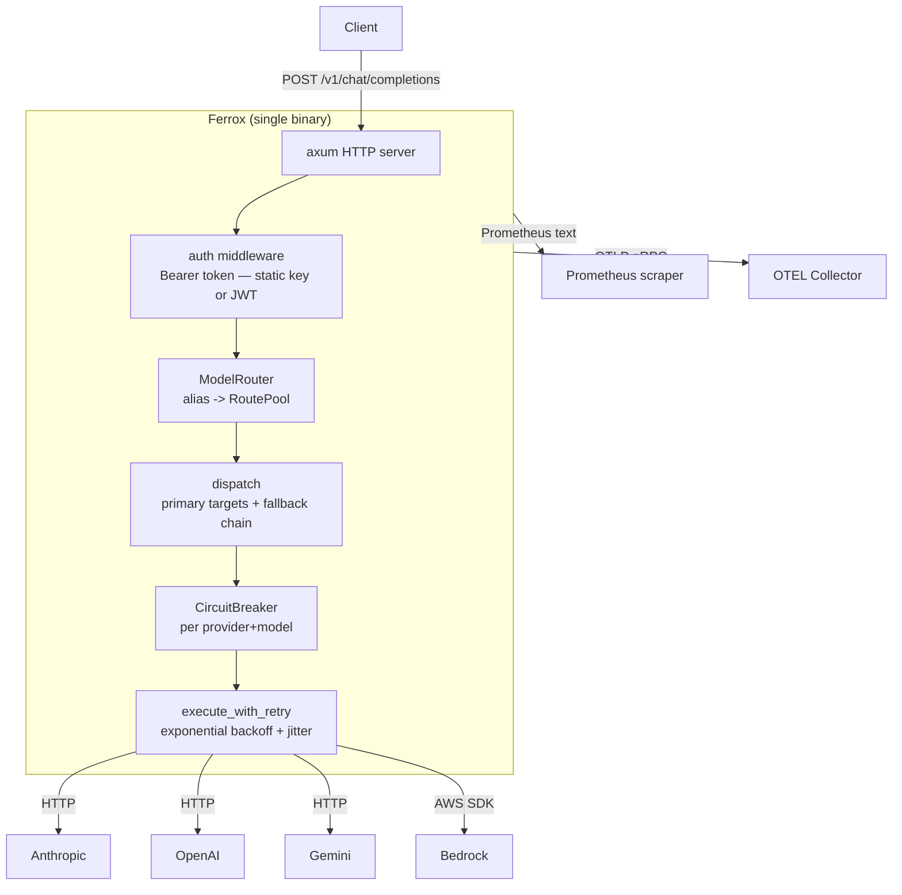
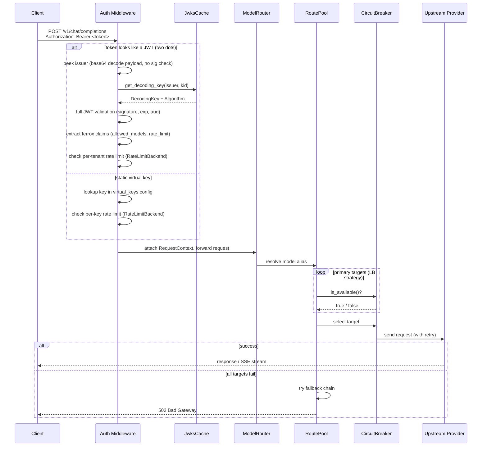
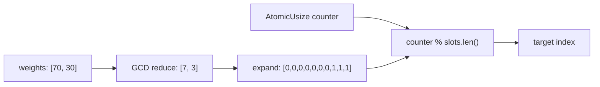
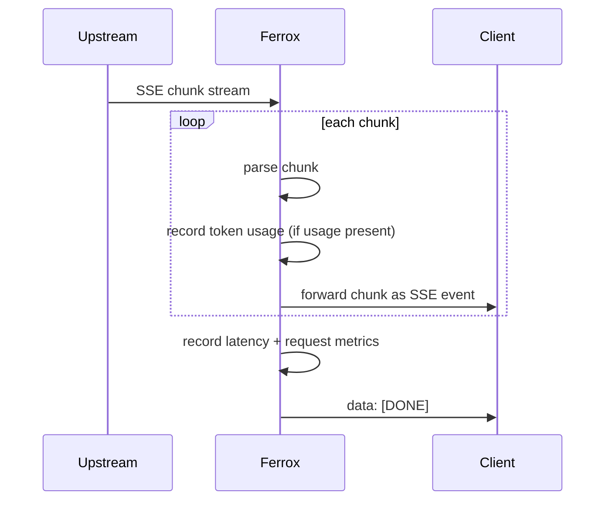
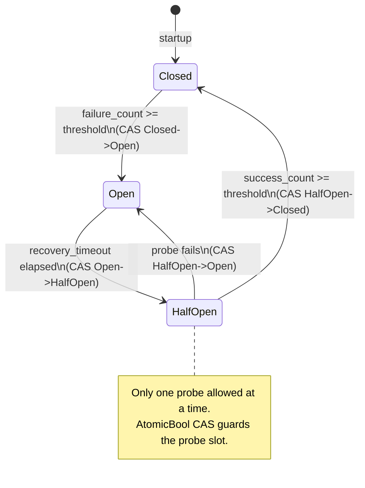

# Architecture

## Overview

Ferrox is a stateless HTTP proxy. Every request is self-contained; no session state is shared between instances. This makes it trivially horizontally scalable.



## Module map

```
src/
  main.rs             startup, graceful shutdown
  server.rs           axum router, middleware stack
  config.rs           YAML loading, env var interpolation, validation
  state.rs            AppState (shared, Arc-wrapped)
  auth.rs             Bearer token auth: static virtual key or JWKS-validated JWT
  jwks.rs             JWKS cache: fetch, TTL refresh, stale fallback, background task
  router.rs           ModelRouter: alias -> Arc<RoutePool>
  error.rs            ProxyError enum, OpenAI-format HTTP responses
  types.rs            OpenAI wire types (request, response, chunk)
  retry.rs            execute_with_retry, is_retryable, backoff_duration
  metrics.rs          thin shim: initialises telemetry::metrics at startup

  providers/
    mod.rs            ProviderAdapter trait, ProviderRegistry, parse_sse_stream
    anthropic.rs      Anthropic Messages API adapter
    openai.rs         OpenAI Chat Completions adapter
    gemini.rs         Gemini generateContent adapter
    bedrock.rs        AWS Bedrock invoke_model adapter

  lb/
    mod.rs            RoutePool, RouteTarget, select_target
    strategy.rs       LbStrategy: RoundRobin, Weighted, Failover, Random
    circuit_breaker.rs  lock-free CircuitBreaker (AtomicU8 state, AtomicU32 counters)

  ratelimit/
    mod.rs            re-exports: RateLimitBackend trait, MemoryBackend, RedisBackend
    backend.rs        RateLimitBackend async trait
    memory.rs         MemoryBackend: lock-free per-instance token buckets (default)
    redis_backend.rs  RedisBackend: sliding-window Lua script via deadpool-redis
    token_bucket.rs   lock-free TokenBucket (AtomicU64 milli-tokens, CAS loop)

  telemetry/
    mod.rs            init_logging (tracing-subscriber stack)
    metrics.rs        Prometheus Lazy<CounterVec/HistogramVec/GaugeVec> statics
    otel.rs           OTLP tracer initialisation and shutdown

  handlers/
    mod.rs
    chat.rs           chat_completions handler, dispatch_non_stream, dispatch_stream
    health.rs         /healthz, /readyz
    models.rs         /v1/models
```

---

## Request lifecycle



---

## Concurrency model

The hot path (routing, circuit breaking, memory rate limiting) is entirely lock-free. The `RwLock` for the JWKS cache is taken only on TTL refresh — rare after warmup.

| Component | Primitive | Notes |
|---|---|---|
| Circuit breaker state | `AtomicU8` | CAS transitions between Closed/Open/HalfOpen |
| Circuit breaker probe guard | `AtomicBool` | CAS allows exactly one probe at a time |
| Failure/success counters | `AtomicU32` | Incremented with `fetch_add` |
| Token bucket (memory backend) | `AtomicU64` | CAS loop subtracts tokens |
| Round-robin counter | `AtomicUsize` | Monotonically incrementing, modulo target count |
| Weighted slot counter | `AtomicUsize` | Monotonically incrementing, modulo slot array length |
| JWKS key cache | `tokio::sync::RwLock` | Write held briefly on TTL refresh (background task) |
| MemoryBackend bucket map | `std::sync::RwLock` | Write held only when a new key is first seen |
| Redis backend | `deadpool-redis` async pool | One Lua round-trip per rated request |

The `AppState` struct is wrapped in `Arc` and cloned into each request handler. The rate limit backend (`Arc<dyn RateLimitBackend>`) is chosen at startup — memory or Redis — and is transparent to the rest of the gateway.

---

## Weighted load balancing

Weights are pre-expanded into a slot array at config load time. Example: weights `[70, 30]` are GCD-reduced to `[7, 3]`, then expanded to 10 slots: `[0,0,0,0,0,0,0,1,1,1]`. The hot path is a single atomic increment and a modulo lookup; no runtime division.



---

## Streaming

SSE responses are passed through with a `stream!` adapter. Token usage from the final upstream chunk is recorded before the `[DONE]` sentinel is appended.



---

## Circuit breaker state transitions



---

## Error handling

All errors are represented by the `ProxyError` enum. It implements `axum::response::IntoResponse`, which maps each variant to the appropriate HTTP status and an OpenAI-compatible JSON body.

Non-retryable errors (401, 403, 404) short-circuit immediately. Retryable errors (5xx, 429, timeouts) go through the retry + fallback pipeline before producing a final error response.
