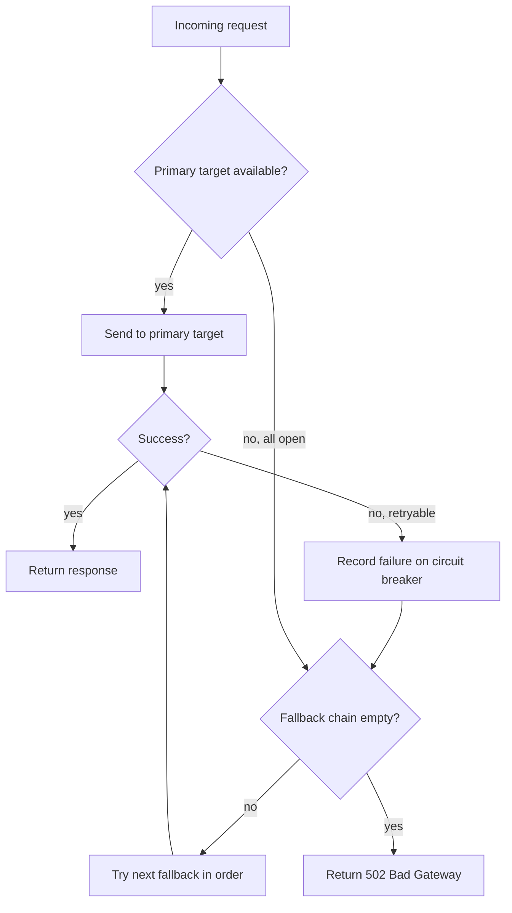
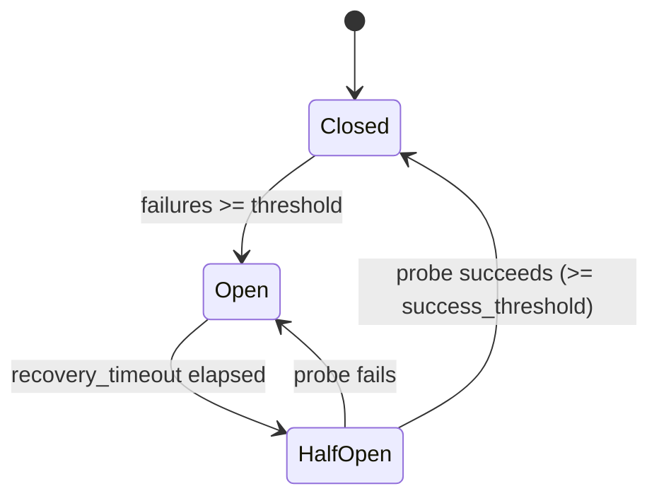

# Routing

Ferrox routes each model alias to a pool of provider targets. The pool has a primary strategy and an optional fallback chain.

## Request dispatch flow



## Classified aliases

An alias configured with `classifier` instead of `routing` has no pool of its own. For each request a classifier reads the conversation and picks one of the alias's tiers, and the request is then handled exactly like one sent to that tier's alias: same strategy, retries, fallback chain and circuit breakers. See [Classified aliases](configuration.md#classified-aliases) for the configuration.

| Outcome (`reason`) | Served by |
|---|---|
| `classified`: the classifier chose a listed tier | That tier's alias |
| `low_confidence`: the answer's confidence is below `confidence_threshold` | `fallback_alias` |
| `timeout`: no answer within the classifier's `timeout_ms` | `fallback_alias` |
| `error`: the classifier failed, or the request has no user text | `fallback_alias` |
| `unknown_choice`: the answer names a tier that is not listed | `fallback_alias` |

The classifier is tried once and never fails a request. Each classified request logs one `Classified request` line with the requested alias, the served alias and the reason.

**What the classifier sees.** Only text: the last user message and as many of the user and assistant turns before it as fit in the classifier's `max_input_chars`. A last user message longer than the cap is cut to its final `max_input_chars` characters. Images, tool calls, tool results and the system prompt (`system` and `developer` messages, Responses `instructions`) are never sent. The same rules apply on all three inbound endpoints.

**Authorization.** `allowed_models` is checked against the alias the client asked for, before the classifier runs. A key allowed `auto` is served by whichever tier is chosen, even if it may not request that tier's alias by name; a key not allowed `auto` gets `403` and the classifier is not called.

**Accounting.** Logs, metrics and usage records carry the alias that served the request (the tier's or the fallback's), not the classified alias.

**The `model` field of the response.** A classified alias changes nothing here; each endpoint reports what it reports for a statically routed alias:

| Endpoint | Non-streaming | Streaming |
|---|---|---|
| `POST /v1/chat/completions` | The upstream's model id | The upstream's model id |
| `POST /v1/responses` | The requested alias (the upstream's model id from a `responses: native` provider) | Same |
| `POST /anthropic/v1/messages` | The upstream's model id | The requested alias |

## Routing strategies

### round_robin

Cycles through available targets in order. Best for spreading load across targets with similar capacity.

```yaml
routing:
  strategy: round_robin
  targets:
    - provider: anthropic-key-1
      model_id: claude-sonnet-4-20250514
    - provider: anthropic-key-2
      model_id: claude-sonnet-4-20250514
```

### weighted

Distributes traffic proportionally by weight. Weights are reduced by their GCD and expanded into a slot array at startup; there is no runtime division.

```yaml
routing:
  strategy: weighted
  targets:
    - provider: anthropic-primary
      model_id: claude-sonnet-4-20250514
      weight: 70
    - provider: anthropic-secondary
      model_id: claude-sonnet-4-20250514
      weight: 30
```

All targets must have a `weight` when using this strategy.

### failover

Always sends to the first available target. Moves to the next only when the current one is unavailable (circuit open).

```yaml
routing:
  strategy: failover
  targets:
    - provider: anthropic-primary
      model_id: claude-opus-4-20250514
```

### random

Picks a random available target for each request. Useful for distributing load without strict ordering.

```yaml
routing:
  strategy: random
  targets:
    - provider: provider-a
      model_id: some-model
    - provider: provider-b
      model_id: some-model
```

---

## Fallback chains

When all primary targets fail (or their circuit breakers are open), Ferrox tries the fallback list in order.

```yaml
models:
  - alias: claude-sonnet
    routing:
      strategy: weighted
      targets:
        - provider: anthropic-primary
          model_id: claude-sonnet-4-20250514
          weight: 70
        - provider: anthropic-secondary
          model_id: claude-sonnet-4-20250514
          weight: 30
      fallback:
        - provider: bedrock-us
          model_id: anthropic.claude-3-5-sonnet-20241022-v2:0
```

Fallback targets also have individual circuit breakers. A fallback with an open circuit is skipped.

---

## Circuit breakers

Each provider-model combination has an independent circuit breaker. It prevents cascading failures by stopping requests to a provider that is consistently failing.

### State machine



### States

| State | Behavior |
|---|---|
| **Closed** | Normal operation. Failures are counted. |
| **Open** | All requests to this target are rejected immediately. |
| **HalfOpen** | One probe request is allowed through. Success closes the circuit; failure re-opens it. |

Only one probe request is permitted at a time in HalfOpen state, preventing a thundering herd on recovery.

A probe that ends without a verdict on the target (an upstream error that does not trigger failover, such as a `400`, or a client that disconnects mid-request) counts as neither success nor failure: the circuit stays HalfOpen and the next request probes again.

### Configuration

```yaml
defaults:
  circuit_breaker:
    failure_threshold: 5      # consecutive failures before opening
    success_threshold: 2      # successful probes needed to close
    recovery_timeout_secs: 30 # how long to wait before trying a probe
```

Per-provider overrides are supported; see [Configuration](configuration.md).

---

## Retries

Before trying the fallback chain, Ferrox retries the same target for transient errors. Backoff is exponential with optional jitter.

Backoff formula: `min(initial_ms * 2^attempt, max_ms) + random(0, initial_ms)`

```yaml
defaults:
  retry:
    max_attempts: 3
    initial_backoff_ms: 100
    max_backoff_ms: 2000
    jitter: true
```

### Retryable errors

| Error | Retried? |
|---|---|
| Upstream timeout | yes |
| Circuit open | yes |
| Provider 5xx | yes |
| Provider 429 | yes |
| Stream error | yes |
| 401, 403, 404 | no |
| Rate limited (local) | no |

Non-retryable errors are returned immediately without retry or fallback.
